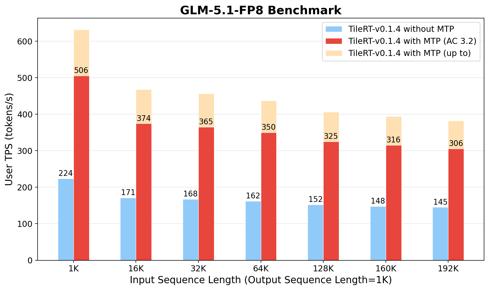

<div align="center">
  
  <h1>TileRT: Tile-Based Runtime for<br>Ultra-Low-Latency LLM Inference</h1>
  <p>
    <a href="https://pypi.org/project/tilert/"></a>
    <a href="https://huggingface.co/Tile-AI/DeepSeek-V3.2-Exp-TileRT"></a>
  </p>
  <p>
    <a href="#overview"><b>Overview</b></a> ·
    <a href="#running-the-generation-example"><b>Generation</b></a> ·
    <a href="#running-the-generation-example-with-multi-token-prediction-mtp"><b>MTP Generation</b></a> ·
    <a href="#installation"><b>Installation</b></a> ·
    <a href="#news"><b>News</b></a>
  </p>
</div>

______________________________________________________________________

<a id="news"></a>

## 📰 News

- 🚀 **2026-06-01 · [v0.1.4](https://github.com/tile-ai/TileRT/releases/tag/v0.1.4) Released**. A major performance upgrade for both DeepSeek-V3.2 and GLM-5, with model quality unchanged.  See the benchmark charts for details.

- 🏭 **2026-05-22 · [TileRT in Production](https://www.tilert.ai/blog/speed-as-the-next-scaling-law-zh.html)**. [GLM-5.1-highspeed](https://docs.bigmodel.cn/cn/guide/models/text/glm-5.1-highspeed) is now live on Z.ai, powered by TileRT — from experimental prototype to real production.

- :fire: **2026-02-14 · [Try the Online Demo](https://www.tilert.ai/)**. Our online demo is now live! Experience ultra-low-latency inference with **GLM-5** and **DeepSeek-V3.2**. [Try it now !](https://www.tilert.ai)

- 🎉 **2026-02-14 · [v0.1.3](https://github.com/tile-ai/TileRT/releases/tag/v0.1.3) Released**. The v0.1.3 release introduces full support for the latest GLM-5 model, achieving up to 500 tokens/s on GLM-5-FP8 and up to 600 tokens/s on DeepSeek-V3.2.

- 🚀 **2026-01-26 · [v0.1.2-alpha.1](https://github.com/tile-ai/TileRT/releases/tag/v0.1.2-alpha.1)**. **Multi-Token Prediction (MTP)** is now available in TileRT! With mtp=3, we achieve decoding rates of up to **590 tokens/s** under synthetic workloads.

<details>
  <summary>Key Milestones</summary>

- ⚡ **2025-12-23 · [v0.1.1](https://github.com/tile-ai/TileRT/releases/tag/v0.1.1)**. Achieved ~**35% further reduction** (3 ~ 4x speedup over baseline) in end-to-end token generation latency on a single node with **8× NVIDIA B200**.

- 🚀 **2025-11-20 · [v0.1.0-alpha.1](https://github.com/tile-ai/TileRT/releases/tag/v0.1.0-alpha.1)**. Initial public release for **DeepSeek-V3.2-Exp**, targeting **ultra-low-latency** inference. Available on [PyPI](https://pypi.org/project/tilert) and [HuggingFace](https://huggingface.co/Tile-AI/DeepSeek-V3.2-Exp-TileRT).

</details>

______________________________________________________________________

<a id="overview"></a>

**TileRT** is a project designed to serve large language models (LLMs) in ultra-low-latency scenarios. Its goal is to push the latency limits of LLMs without compromising model size or quality—enabling models with hundreds of billions of parameters to achieve millisecond-level time per output token (TPOT).

Unlike traditional inference systems optimized for high-throughput batch processing, TileRT prioritizes **responsiveness**, which is critical for applications such as high-frequency trading, interactive AI, real-time decision-making, long-running agents, and AI-assisted coding, where the latency of individual requests matters most.

To achieve this, TileRT introduces a **tile-level runtime engine**. Leveraging a compiler-driven approach, LLM operators are decomposed into fine-grained tile-level tasks, while the runtime dynamically reschedules computation, I/O, and communication across multiple devices in a highly overlapped manner. This design minimizes idle time and improves hardware utilization.

The project is actively evolving, and the underlying compiler techniques will be gradually shared with the community as they are integrated into **TileLang** and **TileScale**.

<p align="center">
  
  <br/>
  <sub><em>GLM-5.1-FP8 token generation speed on 8× NVIDIA B200 with TileRT v0.1.4. Output length 1K, input length 1K–192K. Bars compare TileRT without MTP, with MTP at average acceptance length 3.2, and the peak under best-case MTP acceptance.</em></sub>
</p>

______________________________________________________________________

## Installation

> \[!IMPORTANT\]
> TileRT v0.1.4 is distributed as a **pre-built binary wheel**. The wheel is linked against the exact ABI of the versions listed below. Other combinations of Python, CUDA, or PyTorch versions are **untested and not guaranteed to work** — please reproduce this environment for a supported setup.

### Build environment of the v0.1.4 wheel

The official `tilert==0.1.4` wheel on PyPI was compiled against the following stack. Treat these as **hard requirements**, not lower bounds.

| Component        | Pinned version                                      |
| ---------------- | --------------------------------------------------- |
| GPU              | 8× NVIDIA **B200**                                  |
| NVIDIA driver    | Supports **CUDA 13.2** runtime                      |
| Operating System | Linux **x86_64**, glibc **≥ 2.28** (manylinux_2_28) |
| Python           | **3.12**                                            |
| PyTorch          | **`torch==2.11.0+cu130`**                           |
| `transformers`   | **`4.46.3`**                                        |
| `tokenizers`     | **`0.20.3`**                                        |

### Recommended: pre-built Docker image

The pinned build environment above is preinstalled in our official image
— this is the **recommended way to run v0.1.4** and avoids any version
drift on the host. The image is mirrored to two registries; pull from
whichever is reachable:

```bash
# GitHub Container Registry
docker pull ghcr.io/tile-ai/tilert:cu132-latest

# Docker Hub
docker pull tileai/tilert:cu132-latest
```

Launch a container with all 8 B200 GPUs attached, then install the
wheel inside:

```bash
docker run --rm -it --gpus all --ipc=host \
    -v "$PWD":/workspace -w /workspace \
    ghcr.io/tile-ai/tilert:cu132-latest

# Inside the container — install from PyPI:
pip install tilert==0.1.4

# Or pin the exact wheel from the GitHub Release page directly
# (same artifact, useful when PyPI is unreachable):
pip install https://github.com/tile-ai/TileRT/releases/download/v0.1.4/tilert-0.1.4-cp312-cp312-manylinux_2_28_x86_64.whl
```

Verify the install:

```bash
python -c "import tilert, torch; print('tilert', tilert.__version__, '/ torch', torch.__version__, '/ cuda', torch.version.cuda)"
# Expected: tilert 0.1.4 / torch 2.11.0+cu130 / cuda 13.0
```

Proceed to [Getting Started](#getting-started) to download and convert model weights.

## Getting Started

### Step 1: Download Official Model Weights

Starting from release v0.1.3, TileRT no longer requires downloading pre-converted weights from Hugging Face. Instead, you can download the official model weights directly from the model's source (e.g., Hugging Face), and then convert them using the weight converter script included with the latest TileRT release.

### Step 2: Shard Weights with `weight_converter`

The converter ships inside the `tilert` wheel. It rewrites the official HF
checkpoint into TileRT's per-device layout — 8 shards, one per B200, with
keys suffixed `*_dev_{0..7}` and a fresh `model.safetensors.index.json`.
The runtime loads these shards directly; the original checkpoint is no
longer needed after conversion.

For **DeepSeek-V3.2**:

```bash
python -m tilert.models.preprocess.weight_converter \
  --model_type deepseek-v32 \
  --model_dir "/path/to/DeepSeek-V3.2" \
  --save_dir "/path/to/DeepSeek-V3.2-TileRT"
```

For **GLM-5**:

```bash
python -m tilert.models.preprocess.weight_converter \
  --model_type glm-5 \
  --model_dir "/path/to/GLM-5-FP8" \
  --save_dir "/path/to/GLM-5-FP8-TileRT"
```

`--model_dir` is the directory of the downloaded HF checkpoint;
`--save_dir` is where the sharded TileRT-format weights will land.

### Step 3: Register the Sharded Weights Path

Either pass `--model-weights-dir <path>` on every `tilert.generate`
invocation, or register the path once in `~/.tilert/config.toml` so the
CLI picks it up automatically:

```toml
[weights]
deepseek_v3_2 = "/path/to/DeepSeek-V3.2-TileRT"
glm5          = "/path/to/GLM-5-FP8-TileRT"
```

### Running the Generation Example

The simplest entry point is the bundled CLI. Pick `--model deepseek_v3_2`
or `--model glm5`; weights resolve from `~/.tilert/config.toml` or from
an explicit `--model-weights-dir`:

```bash
python -m tilert.generate --model deepseek_v3_2 --max-new-tokens 1000
```

> \[!NOTE\]
> v0.1.4 ships **two independent backend libraries** (`libtilert_dsv32.so`
> and `libtilert_glm5.so`) and loads exactly one per Python process via
> `tilert.load_backend(model_type)`. Run DeepSeek-V3.2 and GLM-5 in
> separate processes — they cannot coexist in a single interpreter.

To drive generation programmatically, load the backend first, then build
the matching generator:

```python
import tilert
from tilert.models.deepseek_v3_2.generator import DSAv32Generator
from tilert.models.deepseek_v3_2.model_args import ModelArgs

tilert.load_backend("deepseek_v3_2")

generator = DSAv32Generator(
    model_args=ModelArgs(),
    max_new_tokens=1000,
    model_weights_dir="/path/to/DeepSeek-V3.2-TileRT",
    with_mtp=False,
)
generator.from_pretrained()

prompt = (
    "Tell me three jokes:\n\n"
    "1. A dad joke,\n"
    "2. A programmer joke,\n"
    "3. A joke that only makes sense if you've ever tried "
    "to train a large language model.\n"
    "Keep each joke under 15 words."
)

print("Prompt:", prompt)
print("Completion:")
completion = generator.generate(prompt)
```

(For **GLM-5**, swap in `tilert.load_backend("glm5")` and
`from tilert.models.glm_5.generator import GLM5Generator` with
`ModelArgsGLM5`.)

For example, TileRT may generate:

<details>
<summary><b>Sample output (click to expand)</b></summary>

```text
1. I'm afraid for the calendar. Its days are numbered.
2. There are only 10 kinds of people: those who understand binary and those who don't.
3. My model's loss is low, but its answers are still nonsense. Overfitting.
```

</details>

This example demonstrates basic single-step autoregressive generation using the precompiled model.

### Running the Generation Example with Multi-Token Prediction (MTP)

TileRT also supports Multi-Token Prediction (MTP), which allows the model to generate multiple tokens per forward pass and reduces sequential decoding depth. Enable it from the CLI with `--with-mtp`:

```bash
python -m tilert.generate --model deepseek_v3_2 --with-mtp --max-new-tokens 1000
```

Or programmatically, pass `with_mtp=True` to the generator:

```python
import tilert
from tilert.models.deepseek_v3_2.generator import DSAv32Generator
from tilert.models.deepseek_v3_2.model_args import ModelArgs

tilert.load_backend("deepseek_v3_2")

generator = DSAv32Generator(
    model_args=ModelArgs(),
    max_new_tokens=1000,
    model_weights_dir="/path/to/DeepSeek-V3.2-TileRT",
    with_mtp=True,
)
generator.from_pretrained()
prompt = "Tell me 10 jokes, keep them all under 100 words."

print("Prompt:", prompt)
print("Completion:")
completion = generator.generate(prompt)
```

When MTP is enabled, TileRT may report statistics similar to the following during generation:

```text
Accepted length: mean=2.77, min=1, max=4
```

This indicates that, on average, multiple tokens are accepted per decoding step under MTP.

<details>
<summary><b>Sample output (click to expand)</b></summary>

```text
Of course! Here are 10 short jokes for you.

1. I told my wife she was drawing her eyebrows too high. She looked surprised.

2. I invented a new word: Plagiarism.

3. Why don't scientists trust atoms? Because they make up everything.

4. I'm reading a book on anti-gravity. It's impossible to put down.

5. What's the best thing about Switzerland? I don't know, but the flag is a big plus.

6. I told my computer I needed a break, and now it won't stop sending me vacation ads.

7. Why did the scarecrow win an award? He was outstanding in his field.

8. What do you call a fake noodle? An impasta.

9. I told my suitcase there's no vacation, and now it has a lot of baggage.

10. Why don't skeletons fight each other? They don't have the guts.
```

</details>

This example highlights how MTP enables TileRT to efficiently generate longer outputs by accepting multiple tokens per decoding step, while preserving the same Python API interface.

For the full list of CLI flags (sampling, batching, benchmark modes, …), run `python -m tilert.generate --help`.

## Status & Future Work

TileRT is currently offered as a preview release, and we’re just getting started.
We are continuously improving the installation experience and enhancing end-to-end performance. Future releases will keep pushing the boundaries of low-latency generation.

Thank you for your interest and support — stay tuned, even faster token generation is on the way!
